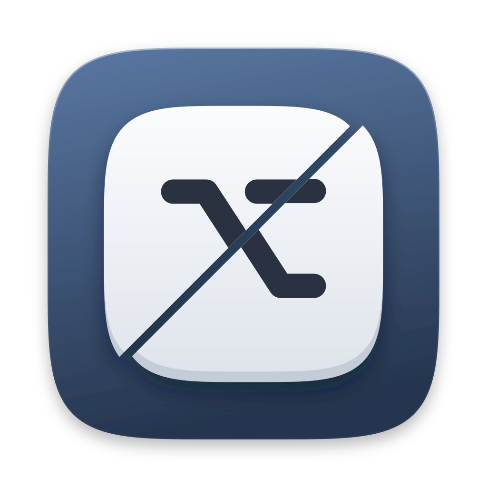
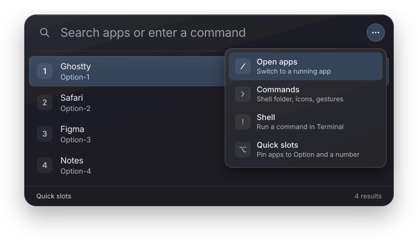
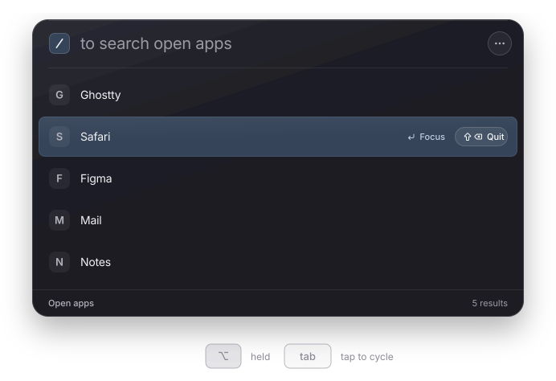
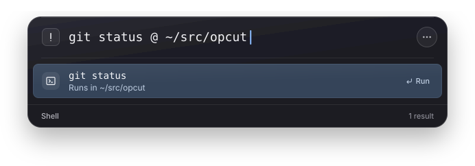

<p align="center">
  
</p>

<h1 align="center">OpCut</h1>

<p align="center">
  More cuts from your <kbd>⌥ Option</kbd> key.<br/>
  A macOS menu bar launcher, app switcher, and command bar.
</p>

<p align="center">
  
  
</p>

<p align="center">
  
</p>

Press <kbd>⌥ Space</kbd> and start typing an app name. Lead with a prefix to switch modes, or pick one from the <kbd>⋯</kbd> button:

| Prefix | Mode      | What it does                                     |
| ------ | --------- | ------------------------------------------------ |
| `/`    | Open apps | Switch to a running app, or quit it              |
| `>`    | Commands  | Change OpCut's settings                          |
| `!`    | Shell     | Run a command in a new Ghostty window            |

With nothing typed, the panel lists your quick slots. Press <kbd>⌫</kbd> on an empty mode to leave it.

## Keys

| Keys                                   | Action                                                    |
| -------------------------------------- | --------------------------------------------------------- |
| <kbd>⌥ Space</kbd>                     | Show or hide OpCut; clicking the menu bar icon does too   |
| <kbd>⌥ Tab</kbd> / <kbd>⇧⌥ Tab</kbd>   | Cycle open apps; release <kbd>⌥</kbd> to switch           |
| <kbd>⌥ 1</kbd> – <kbd>⌥ 9</kbd>        | Open the app in that quick slot                           |
| <kbd>↩</kbd>                           | Open, focus, or run the selected row                      |
| <kbd>⇧ ⌫</kbd>                         | Quit the selected open app, like <kbd>⌘ Q</kbd>           |
| <kbd>esc</kbd>                         | Close the panel                                           |

## Switch apps

Hold <kbd>⌥</kbd> and tap <kbd>Tab</kbd> to step through open apps, most recent first. Let go of <kbd>⌥</kbd> to switch. Press <kbd>/</kbd> mid-cycle to search the list instead.

<p align="center">
  
</p>

A trackpad swipe can open the same list. Run `> Enable three-finger app switcher` and a vertical three-finger swipe opens open apps; Mission Control moves to four fingers. Disabling it restores your previous gesture settings.

The panel works over fullscreen apps and on every Space.

## Quick slots

Pin up to nine apps and open them from anywhere with <kbd>⌥ 1</kbd> through <kbd>⌥ 9</kbd>. To assign a slot, choose **Quick slots** from the <kbd>⋯</kbd> menu, or press <kbd>⌥</kbd> and the slot number while OpCut is open.

If those shortcuts clash with another app, turn them off with `> Disable option shortcuts`.

## Run shell commands

Type `!` and a command. It runs in a new [Ghostty](https://ghostty.org) window, which stays open on a login shell when the command finishes.

<p align="center">
  
</p>

Commands run in your shell folder, `~` by default. Set it once with `> cwd ~/src`, or name a folder for one command by ending it with `@ path`.

Shell mode needs Ghostty installed in `/Applications`.

## Commands

| Command                          | Effect                                             |
| -------------------------------- | -------------------------------------------------- |
| `> refresh`                      | Find newly installed apps                          |
| `> cwd <path>`                   | Set the folder `!` commands run in                 |
| `> slots`                        | Open quick slot settings                           |
| `> shortcuts`                    | Turn <kbd>⌥ 1</kbd>–<kbd>⌥ 9</kbd> on or off       |
| `> icons`                        | Show app icons or letters in results               |
| `> gesture`                      | Turn the three-finger app switcher on or off       |
| `> quit`                         | Quit OpCut                                         |

## Install

Download the latest `.app` from [Releases](https://github.com/notkearash/opcut/releases), or build it yourself with [Rust](https://rustup.rs/) and [Bun](https://bun.sh/):

```bash
bun install
bun run install:app
```

`install:app` builds the app, replaces `/Applications/OpCut.app`, and relaunches it. To build without installing, run `bun run tauri build`; the bundle lands in `src-tauri/target/release/bundle/macos/`.

## Development

```bash
bun run dev
```

Starts Vite and the Tauri window with hot reload. See [AGENTS.md](AGENTS.md) for project layout and conventions.

## License

See [LICENSE](LICENSE).
